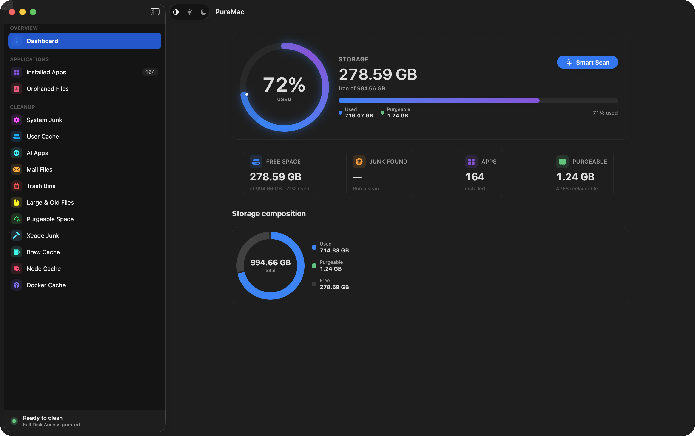
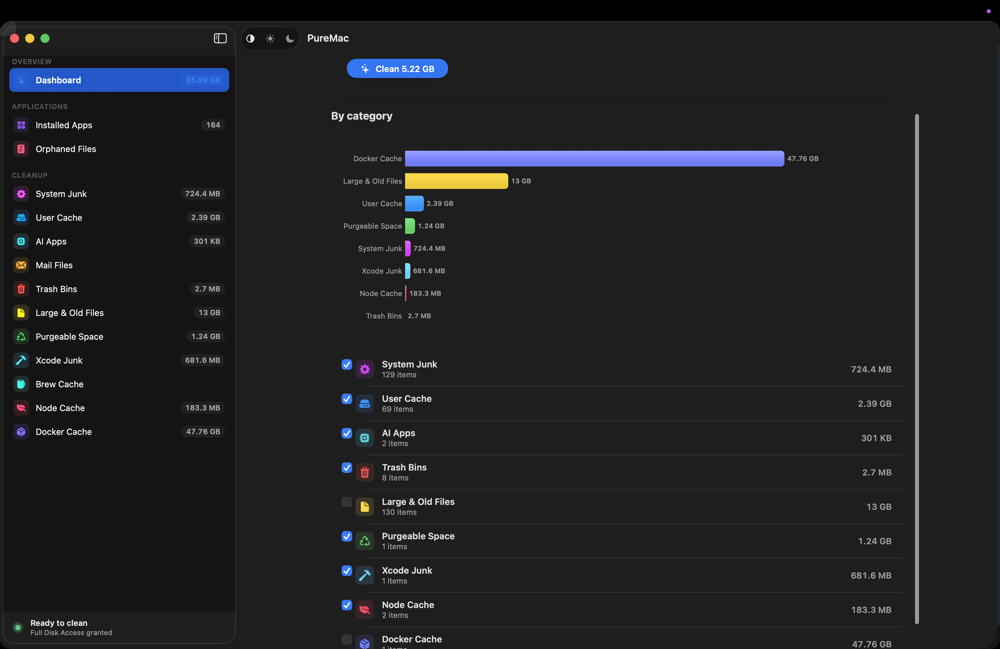

# PureMac

Maintained by [aipieksel](https://github.com/aipieksel). This is a local source fork of [momenbasel/PureMac](https://github.com/momenbasel/PureMac); upstream credits and licenses remain with their respective authors.

PureMac is a native macOS cleaner and app uninstaller that helps you understand where storage is going before you remove anything. It scans installed apps and related files, leftover app data, caches, development artifacts, and other storage categories. Results show paths for review; removal behavior depends on the selected action, so read the [safety notes](#safety-and-privacy) before cleaning.

This fork adds a Space Table for exploring volumes and folders in a sortable view. The Homebrew cask and upstream release linked below install upstream PureMac; build this checkout to use changes in the local source fork. The app has no subscription or built-in telemetry. Scanning and cleaning are local; update checks can use the network.

<p align="center"></p>

<p align="center"></p>

## What it does

### App Uninstaller
Discovers installed apps in supported application locations and uses bundle identifiers, signing metadata, container discovery, and name/path heuristics to find related files. Strict, Enhanced, and Deep sensitivity tiers adjust matching. Results can include false positives and miss files, so review the paths before removal. Apple system apps are excluded from the uninstall list. Finder’s **Services → Uninstall with PureMac** opens the related-file scan for a selected app.

### Orphan Finder
Walks `~/Library` and surfaces files left behind by apps that no longer exist on disk. The matcher compares against bundle identifiers and normalized names of every installed app, so a leftover `~/Library/Containers/com.foo.bar` from an app you deleted in 2022 shows up clearly.

### System Cleaner
Smart Scan uses bounded concurrency, with two category workers by default. Each category has its own scanner:

- **System Junk** - system caches, logs, temp files
- **User Cache** - dynamically discovered, no hardcoded app list
- **AI Apps** - Ollama and LM Studio logs, caches, opt-in history cleanup
- **Mail Files** - downloaded mail attachments
- **Trash Bins** - empties all bins, including external volumes
- **Large & Old Files** - >100 MB or older than 1 year (never auto-selected)
- **Xcode Junk** - DerivedData, Archives, simulator caches
- **Brew Cache** - respects custom `HOMEBREW_CACHE`
- **Node Cache** - npm, yarn classic, pnpm content-addressable store
- **Docker Cache** - images, containers, build cache

> **APFS purgeable space:** PureMac lists this as a separate cleanable category and uses `diskutil apfs purgePurgeable /` when it is selected. This asks macOS to reclaim eligible space; it does not delete a named file or guarantee that the displayed estimate will become free space.

### Space Table (local source fork)

The added **Space Table** view discovers browsable volumes and shows their used, available, and total space. Open a volume to explore folders and files in a sortable table with sizes and shares of the scanned location. Expand folders or follow the path breadcrumb to inspect where space is used; reveal an item in Finder from its context menu. The view reports unreadable items and shows system data that its file scan cannot account for separately.

Folder previews and background indexing make deeper locations available as scanning proceeds. A per-volume cache saves measured directory results for later use and invalidates them when the volume changes enough or selected items are removed. You can select eligible items and move them to the macOS Trash after a confirmation. Scanning can be cancelled, and protected paths are excluded from removal.

This feature is in this source fork. Build this checkout to use it; the upstream Homebrew cask and release download do not include it.

### Scheduled Cleaning
Optional. Configurable interval (hourly to monthly), with auto-clean threshold so background runs only fire when there's something meaningful to remove.

## Safety and privacy

PureMac shows paths before interactive removal, but actions have different recovery options. App Uninstaller, Orphan Finder, and Space Table use the macOS Trash API. Cleaner actions can permanently delete files, empty Trash, or prune Docker data; binary thinning and language cleanup modify app bundles. Review each selection before confirming. Optional scheduled cleaning can run without a fresh review.

Scanning and cleaning run locally without telemetry or automatic crash uploads. Update checks and opening upstream release pages use the network. Full Disk Access increases scan coverage but also grants access to sensitive files, so grant it only if you trust the app and need those scans. The source for removal decisions is under [`PureMac/Services`](PureMac/Services) and [`PureMac/Logic/Scanning`](PureMac/Logic/Scanning).

APFS decides how much purgeable space can actually be reclaimed. App-related file matching is heuristic and can miss related files or include unrelated ones.

## Install

The Homebrew command and release link below install upstream PureMac. They do not include this fork’s Space Table.

```bash
brew install --cask puremac
```

Or download an app from [upstream Releases](https://github.com/momenbasel/PureMac/releases/latest) and follow that release’s installation instructions. Signing, notarization, and supported architectures depend on the downloaded artifact.

For this checkout, follow [Local build and installation](docs/LOCAL-BUILD.md). The local script builds for the current Mac’s architecture and signs ad-hoc unless `PUREMAC_SIGN_IDENTITY` is set. It does not search the keychain for a personal signing identity and does not notarize the app.

### Build from source

```bash
brew install xcodegen
# From this local source folder
xcodegen generate
xcodebuild -project PureMac.xcodeproj -scheme PureMac -configuration Release \
  -derivedDataPath build CODE_SIGNING_ALLOWED=NO build
open build/Build/Products/Release/PureMac.app
```

## Permissions

**Full Disk Access** allows PureMac to inspect protected locations such as Mail data and app containers. Without it, some paths are inaccessible and scan results may be incomplete. Coverage depends on the files and permissions on your Mac; there is no verified percentage for what will be missed.

The first-launch onboarding walks you through granting it with an animated preview of the exact toggle you need to flip. If you skip it, the dashboard surfaces a single-click "Set up" pill. If a cleanup fails because of a permission issue, PureMac opens System Settings, reveals its bundle in Finder so you can drag it into the FDA list, polls the permission state every second, and auto-retries the failed batch the moment you grant access. You never have to re-select anything.

What PureMac does *not* do:
- It does not collect telemetry, crash reports, or usage analytics.
- Local scanning and cleaning do not require a network connection; update checks and opening release pages do.
- Removal behavior varies by action: some use Trash, while cleaner operations can permanently delete or modify files.

## Troubleshooting

### Launchpad or Dock shows an old icon

macOS may retain an icon after reinstalling or upgrading. Open the installed app once and allow the Dock to refresh; a restart can clear a persistent cache. Check the installed artifact before troubleshooting the local source fork.

## Screenshots

The images above show the upstream design. Build and inspect this checkout to verify the local fork on your Mac.

## Architecture

```
PureMac/
  Logic/Scanning/     - Heuristic scan engine, locations database, conditions
  Logic/Utilities/    - Structured logging
  Models/             - Data models, typed errors
  Services/           - Scan engine, cleaning engine, permission coordinator, scheduler
  ViewModels/         - Centralized app state
  Views/              - Native SwiftUI views
    Apps/             - App uninstaller views
    Components/       - Shared components (FDA demo, permission sheet, theme)
    Orphans/          - Orphan finder
    Settings/         - Native Form-based settings
```

Key components:
- **AppPathFinder** - Heuristic matching engine for discovering app-related files
- **Locations** - 120+ macOS filesystem search paths
- **Conditions** - 25 per-app matching rules for edge cases (Xcode, Chrome, VS Code, etc.)
- **PermissionCoordinator** - Single source of truth for FDA prompts, polling, and post-grant retries
- **FullDiskAccessManager** - TCC probe + registration; broad probe paths (Mail, Safari, Messages, AddressBook, Calendars) so macOS catalogs the bundle reliably
- **CleaningEngine** - Symlink-resistant deletion with an allow-list, NSAppleScript-based admin escalation for root-owned items, NUL-separated path staging for xargs

## Security

- Symlink attack prevention: paths are resolved before validation, re-resolved immediately before unlink to close TOCTOU windows.
- Allow-list cleaning: a path that doesn't sit inside an explicit safe-root is refused, even for the user-level pass.
- Admin escalation is gated by a *narrower* allow-list (app bundles, package receipts, launch plists) than the normal cleaner — root-owned items can only be removed inside those roots.
- System app protection: Apple's bundles cannot be uninstalled, regardless of selection.
- Interactive cleaning asks for confirmation by default; settings can disable that prompt. Optional scheduled auto-cleaning does not request confirmation for each run.

If you find a vulnerability, please open a private security advisory rather than a public issue.

## Contributing

Pull requests welcome. See [CONTRIBUTING.md](CONTRIBUTING.md).

Especially welcome:
- Per-category size and date filter presets
- Wider XCTest coverage for `AppState` and the scan engine
- Translations beyond the current set (en, ar, es, ja, pt-BR, zh-Hans, zh-Hant)
- App icon design

## Acknowledgments

- **[@nguyenhuy158](https://github.com/nguyenhuy158)** - Search and filter feature ([#18](https://github.com/momenbasel/PureMac/issues/18), [#29](https://github.com/momenbasel/PureMac/pull/29))
- **[@edufalcao](https://github.com/edufalcao)** - Cleaning safety guards and confirmation dialogs ([#30](https://github.com/momenbasel/PureMac/pull/30))
- **[@zeck00](https://github.com/zeck00)** - UI overhaul ([#31](https://github.com/momenbasel/PureMac/pull/31)), app uninstaller with system app protection ([#32](https://github.com/momenbasel/PureMac/pull/32)), onboarding experience ([#33](https://github.com/momenbasel/PureMac/pull/33))
- **[@0x-man](https://github.com/0x-man)** - Symlink security vulnerability report ([#25](https://github.com/momenbasel/PureMac/issues/25))
- **[@ansidev](https://github.com/ansidev)** - Checkbox interaction bug report ([#34](https://github.com/momenbasel/PureMac/issues/34))
- **[@fengcheng01](https://github.com/fengcheng01)** - App uninstaller feature request ([#28](https://github.com/momenbasel/PureMac/issues/28))
- **[@scholzfuni](https://github.com/scholzfuni)** - Modularization proposal ([#23](https://github.com/momenbasel/PureMac/issues/23))
- **[@Zonharo](https://github.com/Zonharo)** - In-app auto-update request ([#94](https://github.com/momenbasel/PureMac/issues/94))

## License

MIT. See [LICENSE](LICENSE). Use it, fork it, ship it under your own name if you want - the only thing the license asks is that the notice stays.
